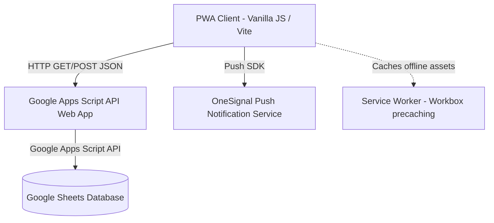

# 🌟 Sistema TUIG (Terreiro de Umbanda Irmãos de Gandra)
> **Plataforma Corporativa de Controle de Presenças, Rituais e Gestão de Médiuns**

[](https://vite.dev/)
[](https://developers.google.com/apps-script)
[](https://vite.dev/)
[](https://vite-pwa-org.netlify.app/)
[](https://opensource.org/licenses/MIT)

O **Sistema TUIG** é uma solução corporativa sob medida desenvolvida para a gestão e controle administrativo de Terreiros. O projeto consiste em um aplicativo mobile-first do tipo **PWA (Progressive Web App)** de alta performance que se conecta a uma arquitetura serverless no **Google Apps Script** utilizando planilhas do **Google Sheets** como banco de dados transacional e relacional em nuvem.

---

## 📌 Índice
1. [Arquitetura e Fluxo de Dados](#-arquitetura-e-fluxo-de-dados)
2. [Recursos do Sistema](#-recursos-do-sistema)
3. [Estrutura do Repositório](#-estrutura-do-repositório)
4. [Instalação e Execução Local](#-instalação-e-execução-local)
5. [Configuração do Banco de Dados (Google Sheets)](#-configuração-do-banco-de-dados-google-sheets)
6. [Implantação e Ciclo de Vida (Deploy)](#-implantação-e-ciclo-de-vida-deploy)
7. [Geofencing e Janelas de Funcionamento](#-geofencing-e-janelas-de-funcionamento)
8. [Segurança e Boas Práticas](#-segurança-e-boas-práticas)
9. [Licença](#-licença)

---

## 🏗️ Arquitetura e Fluxo de Dados

A arquitetura do sistema foi desenhada para eliminar custos de infraestrutura e hospedagem de servidores tradicionais (zero-cost maintenance), garantindo velocidade e estabilidade ao delegar o processamento pesado à infraestrutura do Google.



### Detalhes do Fluxo:
1. **Requisições de Leitura (GET)**: O cliente solicita dados passando parâmetros na Query String (Ex: `?action=login&email=...`). O Apps Script consulta as abas da planilha do Google e devolve uma resposta estruturada em JSON contendo um payload de dados e timestamps com cabeçalhos CORS (`*`) liberados.
2. **Requisições de Escrita (POST)**: Operações como gravação de presença, abonos em massa e justificativas utilizam o método `POST` contendo um payload em formato JSON. O Apps Script realiza o parse no servidor e executa inserções atômicas nas tabelas (linhas) correspondentes do Sheets.

---

## 🚀 Recursos do Sistema

### 👤 Portal do Médium (Painel de Autenticação Básica)
*   **Login Passwordless**: Autenticação rápida com validação direta do e-mail do médium cadastrado na planilha.
*   **Geofencing (Presença via GPS)**: Coleta de coordenadas geográficas do usuário no momento do clique, calculando a distância pelo método matemático de Haversine em relação à localização do Terreiro. Bloqueia registros fora da tolerância física (default: 25 metros).
*   **Controle Temporal de Rituais**: Acompanha o histórico de rituais realizados pelo médium e notifica se o intervalo obrigatório (intervalo padrão: 21 dias) entre rituais foi cumprido antes de liberar novas práticas.
*   **Justificativa de Faltas**: Permite a solicitação de abonos ou justificativas de ausências em eventos passados. As informações são enviadas diretamente para revisão dos administradores.

### 🛠️ Painel de Controle Administrativo (Admin & Master Admin)
*   **Métricas Dinâmicas (Dashboard)**: Estatísticas completas que incluem número de médiuns ativos, média de presença por dia, frequência total da turma de Sexta e Sábado.
*   **Controle de Assiduidade**: Ranking ordenado de frequência dos médiuns, destacando visualmente porcentagens de comparecimento baixas.
*   **Chamada em Massa (Abonos e Presenças)**: Possibilita ao administrador marcar a presença de turmas inteiras ou de médiuns individuais de forma retroativa, seja por atrasos de sincronização de GPS ou necessidades rituais.
*   **Relatórios em PDF**: Botão integrado para exportação instantânea em PDF formatado de listas de presença e relatórios.

---

## 📁 Estrutura do Repositório

O projeto adota uma arquitetura limpa e baseada em componentes Vanilla. Abaixo está o mapa e a descrição dos diretórios:

```
├── Code.gs                   # Backend API: Código-fonte do Google Apps Script
├── index.html                # Arquivo raiz do cliente web e inicializador do SPA
├── package.json              # Configurações do npm, scripts de compilação e dependências
├── vite.config.js            # Arquivo de configuração de empacotamento e build do Vite
├── public/                   # Recursos estáticos servidos diretamente pelo PWA
│   ├── logo.png              # Logotipo oficial e ícone do aplicativo
│   ├── manifest.json         # Arquivo de metadados PWA para instalação mobile/desktop
│   ├── sw.js                 # Script do Service Worker configurado via Workbox
│   └── vite.svg              # Recurso nativo do Vite
└── src/                      # Código-fonte principal do frontend
    ├── config.js             # Configuração da URL da API de Produção
    ├── style.css             # Folha de estilo centralizada do sistema (Dark Mode Premium)
    ├── main.js               # Orquestrador de inicialização, roteamento SPA e controle de sessão
    ├── student.js            # Controladores e views para a área do aluno/médium
    ├── admin.js              # Controladores, views, gráficos (Chart.js) da área administrativa
    └── utils.js              # Helpers, formatação de datas, gerador de modais e cálculos matemáticos
```

---

## 📦 Instalação e Execução Local

### Pré-requisitos
*   [Node.js](https://nodejs.org/) (versão LTS recomendada: 18.x ou 20.x).
*   [NPM](https://www.npmjs.com/) (gerenciador de pacotes padrão do Node).

### Execução Passo a Passo:

1.  **Clone o projeto para seu computador local**:
    ```bash
    git clone https://github.com/Viniguerra19/Sistema-Tuig.git
    cd Sistema-Tuig
    ```

2.  **Instale os pacotes e dependências**:
    ```bash
    npm install
    ```

3.  **Execute o servidor de desenvolvimento**:
    ```bash
    npm run dev
    ```
    O Vite iniciará o projeto localmente no endereço `http://localhost:3000` (ou porta alternativa) e abrirá automaticamente no navegador.

4.  **Gere a build otimizada para produção**:
    ```bash
    npm run build
    ```
    Este comando compila o código-fonte gerando arquivos estáticos minificados na pasta `dist/` pronta para publicação.

---

## 📊 Configuração do Banco de Dados (Google Sheets)

O banco de dados é hospedado em uma Planilha Google. A estrutura e nomenclatura exata das colunas é crítica para o funcionamento do script:

### 1. Estrutura das Abas da Planilha

*   **Aba `Usuários`**: Cadastro geral dos usuários e permissões do sistema.
    *   `Coluna A`: **Email** *(Identificador único/Login)*
    *   `Coluna B`: **Nome**
    *   `Coluna C`: **Permissão** *(`master_admin`, `admin`, ou `user`)*
    *   `Coluna D`: **Cursos** *(Lista separada por vírgulas, ex: `Benzimento, Ervaria`)*
    *   `Coluna E`: **Áreas** *(Configuração de escopo para admins locais)*
    *   `Coluna F`: **Turma** *(`Sexta`, `Sábado` ou `Ambos`)*

*   **Aba `Rituais`**: Registro cronológico de rituais.
    *   `Coluna A`: **Email** *(Chave estrangeira relacionando a Usuários)*
    *   `Coluna B`: **Ritual** *(Nome do ritual realizado)*
    *   `Coluna C`: **Data** *(Formato: DD/MM/YYYY)*
    *   `Coluna D`: **Notas** *(Observações da atividade)*

*   **Aba `Presenças`**: Registro de entrada de presença.
    *   `Coluna A`: **Data/Hora** *(Timestamp do envio)*
    *   `Coluna B`: **Email** *(Chave estrangeira relacionando a Usuários)*
    *   `Coluna C`: **Nome**
    *   `Coluna D`: **Registrado Por** *(`Auto` se feito pelo médium ou e-mail do admin)*
    *   `Coluna E`: **Status GPS** *(`Dentro do Raio` ou `Fora do Raio (X metros)`)*
    *   `Coluna F`: **ID do Dispositivo** *(DeviceId gerado para fins de auditoria)*

*   **Aba `Agenda`**: Agenda de eventos do Terreiro.
    *   `Coluna A`: **Data** *(Data limite para presença)*
    *   `Coluna B`: **Nome do Evento**
    *   `Coluna C`: **Turma** *(`Sexta`, `Sábado`, `Geral` ou `Ambos`)*

*   **Aba `Justificativas`**: Logs de justificativa de faltas.
    *   `Coluna A`: **Data Evento**
    *   `Coluna B`: **Email**
    *   `Coluna C`: **Nome**
    *   `Coluna D`: **Motivo**
    *   `Coluna E`: **Status** *(`Pendente`, `Aprovado` ou `Rejeitado`)*

---

## 🚀 Implantação e Ciclo de Vida (Deploy)

### Deploy do Backend (Google Apps Script)
1.  Na sua planilha Google configurada, vá em **Extensões** -> **Apps Script**.
2.  Substitua todo o código padrão do editor pelo conteúdo do arquivo `Code.gs` contido neste repositório.
3.  Altere as constantes no início do script:
    *   `SPREADSHEET_ID`: Insira o ID da sua planilha (ex: `1N8gsG2A99KI1...voIu4QWc`).
    *   `TERREIRO_LAT` e `TERREIRO_LON`: Ajuste as coordenadas do ponto central geográfico do Terreiro.
    *   `RAIO_TOLERANCIA_METROS`: Distância máxima permitida (default: 25).
4.  Clique em **Implantar** (Deploy) -> **Nova implantação**.
5.  Selecione **App da Web** (Web App).
    *   **Executar como**: `Eu` *(Sua conta do Google)*.
    *   **Quem tem acesso**: `Qualquer pessoa` *(Necessário para comunicação via API do cliente)*.
6.  Clique em **Implantar** e conceda as permissões de acesso ao script.
7.  Copie o **URL do aplicativo da web** gerado.

### Configurando a Conexão no Frontend
Abra o arquivo `src/config.js` do projeto frontend e insira o URL copiado:
```javascript
export const API_URL = "SUA_URL_DO_WEB_APP_DO_APPS_SCRIPT_AQUI";
```

---

## 📍 Geofencing e Janelas de Funcionamento

Para mitigar a possibilidade de fraudes de registros de frequência fora do local físico, o backend do script executa validações baseadas em tempo e espaço:

### 1. Cálculo da Distância (Fórmula de Haversine)
O script calcula a distância geodésica em metros de forma nativa a partir da latitude e longitude do dispositivo do usuário e do Terreiro:
$$d = 2R \arcsin\left(\sqrt{\sin^2\left(\frac{\Delta \varphi}{2}\right) + \cos(\varphi_1) \cos(\varphi_2) \sin^2\left(\frac{\Delta \lambda}{2}\right)}\right)$$
Se a distância obtida for maior que o raio tolerado, a linha de presença é marcada como `Fora do Raio` e os administradores são notificados na aba do Sheets.

### 2. Janelas Horárias Oficiais de Presença
O sistema possui regras rígidas que limitam o envio de presença apenas nos seguintes períodos configurados no backend:
*   **Turma de Sexta-feira**: Sexta das 18:00h até Sábado 02:00h da manhã.
*   **Turma de Sábado**: Sábado das 18:00h até as 23:00h.

---

## 🔒 Segurança e Boas Práticas

*   **Segurança CORS**: O backend do Apps Script está configurado para retornar headers CORS abertos (`Access-Control-Allow-Origin: *`) permitindo que aplicações Web e PWA hospedadas em plataformas de hospedagem rápida (ex: Hostinger, Vercel, Netlify) façam requisições sem erros.
*   **Armazenamento Local**: A sessão ativa do usuário (e-mail e permissão) é persistida de forma segura no `localStorage` do dispositivo para evitar a necessidade de logins recorrentes.
*   **Minificação**: A build de produção gerada pelo Vite automatiza a ofuscação de logs internos e otimiza assets para carregamento rápido mesmo sob conexões de internet 3G/4G instáveis.

---

## 📄 Licença

Este projeto é de código aberto e está licenciado sob a licença **[MIT](LICENSE)**. Você está livre para copiar, modificar e utilizar o sistema para fins de gerenciamento e organização comunitária.
